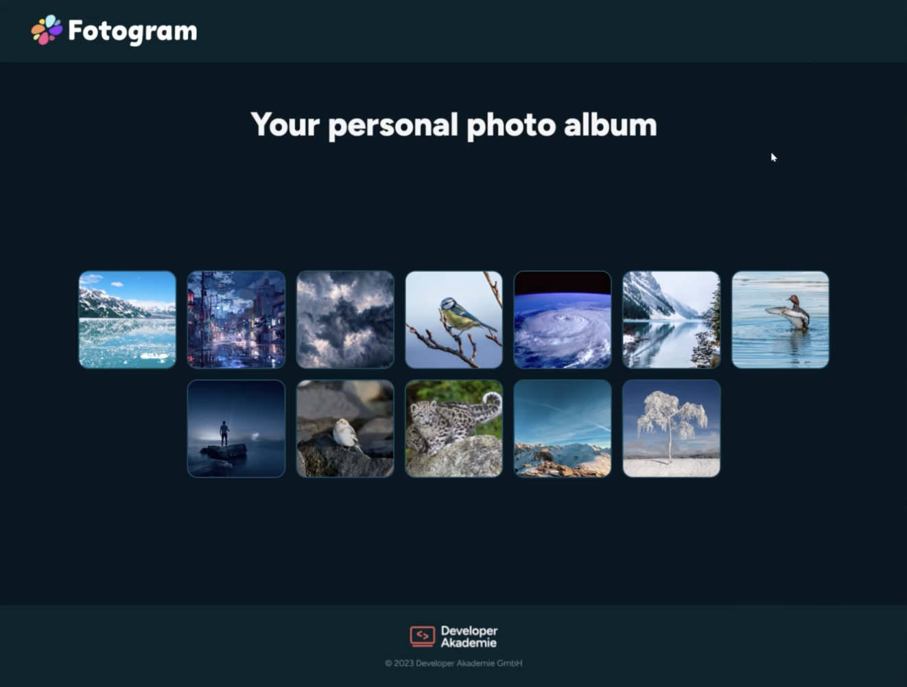

# Fotogram
📸 Fotogram - Interaktive Fotoalbum WebApp für Foto-Management. Lernprojekt mit CRUD-Funktionalität, Variablen &amp; Datenstrukturen. Ermöglicht Upload, Bearbeitung und Organisation von Fotos. Built with HTML, CSS &amp; JavaScript. Perfekt für JavaScript-Grundlagen!


## 🎯 Projektübersicht

**Fotogram** ist eine moderne Webanwendung, die als Lernprojekt entwickelt wurde, um grundlegende Webentwicklungskonzepte zu vertiefen. Das Projekt demonstriert die praktische Anwendung von JavaScript, HTML und CSS zur Erstellung einer funktionsfähigen Fotoalbum-Anwendung.

## ✨ Features

- **📤 Foto-Upload**: Einfaches Hochladen von Bildern
- **📝 Album-Verwaltung**: Erstellen, Bearbeiten und Löschen von Fotoalben
- **🎨 Interaktive Benutzeroberfläche**: Intuitive Bedienung und responsive Design
- **🔍 Foto-Ansicht**: Detailansicht einzelner Fotos
- **📱 Responsive Design**: Optimiert für Desktop und mobile Geräte

## 🛠️ Tech-Stack

- **Frontend**: HTML5, CSS3, JavaScript (Vanilla)
- **Styling**: Custom CSS mit modernem Design
- **Funktionalität**: CRUD-Operationen (Create, Read, Update, Delete)

## 🎓 Lernziele

Dieses Projekt wurde entwickelt, um folgende Programmierkonzepte zu vermitteln:

- ✅ **Variablen und Datenstrukturen**: Effiziente Datenspeicherung und -verwaltung
- ✅ **CRUD-Operationen**: Vollständige Implementierung von Create, Read, Update, Delete
- ✅ **Kontrollstrukturen**: Schleifen und Bedingungen zur Steuerung der App-Logik
- ✅ **DOM-Manipulation**: Dynamische Benutzeroberflächen mit JavaScript
- ✅ **Event-Handling**: Interaktive Funktionalitäten

## 🚀 Installation & Setup

1. **Repository klonen**
    
    ```bash
    git clone https://github.com/yourusername/fotogram.git
    cd fotogram
    ```
    
2. **Projekt starten**
    
    ```bash
    # Einfach die index.html in einem Browser öffnen
    # Oder mit einem lokalen Server:
    npx serve .
    # Dann http://localhost:3000 im Browser öffnen
    ```
    

## 📁 Projektstruktur

```
fotogram/
├── index.html          # Hauptseite
├── css/
│   ├── style.css       # Haupt-Stylesheet
│   └── responsive.css  # Mobile Optimierungen
├── js/
│   ├── app.js          # Hauptlogik
│   ├── fotomanager.js  # Foto-Verwaltung
│   └── utils.js        # Hilfsfunktionen
├── assets/
│   ├── images/         # Beispielbilder
│   └── icons/          # UI-Icons
└── [README.md](http://README.md)
```

## 💡 Verwendung

1. **Fotos hochladen**: Klicke auf den Upload-Button und wähle deine Bilder aus
2. **Alben erstellen**: Organisiere deine Fotos in verschiedenen Alben
3. **Fotos bearbeiten**: Ändere Titel und Beschreibungen deiner Bilder
4. **Galerie durchsuchen**: Navigiere durch deine Fotosammlung

## 🎯 Voraussetzungen

- **Module 1-6** der Developer Akademie durchgearbeitet
- **Grundverständnis** von HTML und CSS
- **Verständnis** grundlegender Programmierkonzepte (Variablen, Datentypen, Funktionen)
- Moderner Webbrowser (Chrome, Firefox, Safari, Edge)

## 📚 Weiterführende Ressourcen

- [JavaScript Dokumentation](https://developer.mozilla.org/de/docs/Web/JavaScript)
- [HTML5 Referenz](https://developer.mozilla.org/de/docs/Web/HTML)
- [CSS3 Referenz](https://developer.mozilla.org/de/docs/Web/CSS)

## 🤝 Beitragen

Da dies ein Lernprojekt ist, sind Verbesserungsvorschläge und Feedback sehr willkommen!

1. Fork das Repository
2. Erstelle einen Feature-Branch (`git checkout -b feature/amazing-feature`)
3. Committe deine Änderungen (`git commit -m 'Add amazing feature'`)
4. Push zum Branch (`git push origin feature/amazing-feature`)
5. Öffne einen Pull Request

## 📄 Lizenz

Dieses Projekt steht unter der MIT Lizenz. Siehe [LICENSE](LICENSE) für weitere Details.

## 👨‍💻 Autor

**Paul Angeles** - [GitHub Profile](https://github.com/Paulito12209)

---

> **Hinweis**: Dieses Projekt wurde als Teil der Developer Akademie Ausbildung entwickelt und dient primär Lernzwecken. Es demonstriert die praktische Anwendung von Webentwicklungs-Grundlagen.
> 

⭐ **Falls dir das Projekt gefällt, gib ihm gerne einen Stern!**
